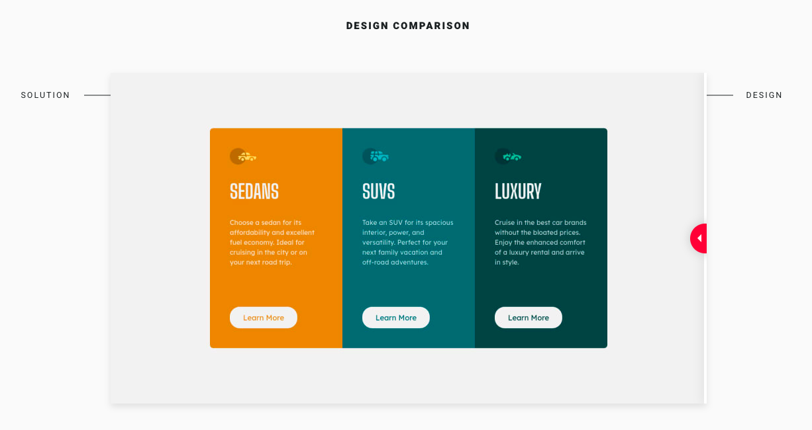

# Frontend Mentor - 3-column preview card component solution

This is a solution to the [3-column preview card component challenge on Frontend Mentor](https://www.frontendmentor.io/challenges/3column-preview-card-component-pH92eAR2-). Frontend Mentor challenges help you improve your coding skills by building realistic projects.

## Table of contents

- [Frontend Mentor - 3-column preview card component solution](#frontend-mentor---3-column-preview-card-component-solution)
  - [Table of contents](#table-of-contents)
  - [Overview](#overview)
    - [The challenge](#the-challenge)
    - [Screenshot](#screenshot)
    - [Links](#links)
  - [My process](#my-process)
    - [Built with](#built-with)
    - [What I learned](#what-i-learned)
  - [Author](#author)

## Overview

### The challenge

Users should be able to:

- View the optimal layout depending on their device's screen size
- See hover states for interactive elements

### Screenshot

### Links

- Solution URL: [https://github.com/tiagobw/3-column-preview-card-component](https://github.com/tiagobw/3-column-preview-card-component)
- Live Site URL: [https://3-column-preview-card-component-frontendmentor-challenge.netlify.app/](https://3-column-preview-card-component-frontendmentor-challenge.netlify.app/)

## My process

### Built with

- Semantic HTML5 markup
- Flexbox
- CSS Grid
- Mobile-first workflow
- [Tailwind CSS](https://tailwindcss.com/) - For styles

### What I learned

While working through this project, I had to tweak the build scripts to deploy the project. I know I should've used Webpack or a similar tool for this job, but I preferred to use a more manual workflow for such a small project.

I like better to use the BEM CSS methodology, but in this case, I wanted to give a framework a shot, and my favorite is Tailwind CSS.

The projects from Frontend Mentor are great for messing around with a variety of technologies.

## Author

- Frontend Mentor - [@tiagobw](https://www.frontendmentor.io/profile/tiagobw)
